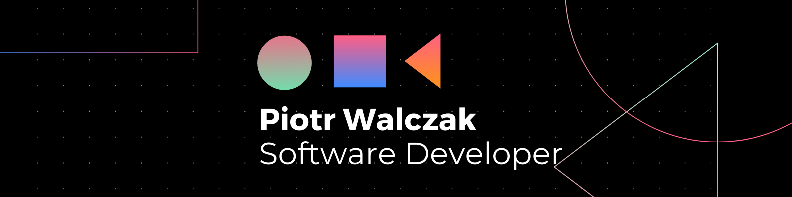

  

<h1 align="center">hey there 👋</h1>

###

  
  
  

###

 

  

###

<h3 align="left">👩‍💻  About Me</h3>

###

<h3 align="left">I'm Piotr. Software developer from Poland. I love low level programming. I code primarily in C and C++, but all well known technologies are listed below.  - 🔭 I’m currently working on alg-lib library. - ⚡ In my free time I train martial arts and running.</h3>

###

<h3 align="left">🛠 Language and tools</h3>

###

  
  
  
  
  
  
  
  
  
  
  
  
  
  
  
  
  
  
  
  
  
  
  

###

<h3 align="left">🔥   My Stats :</h3>

###

  
  
  

###
